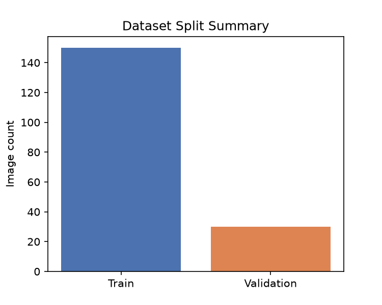
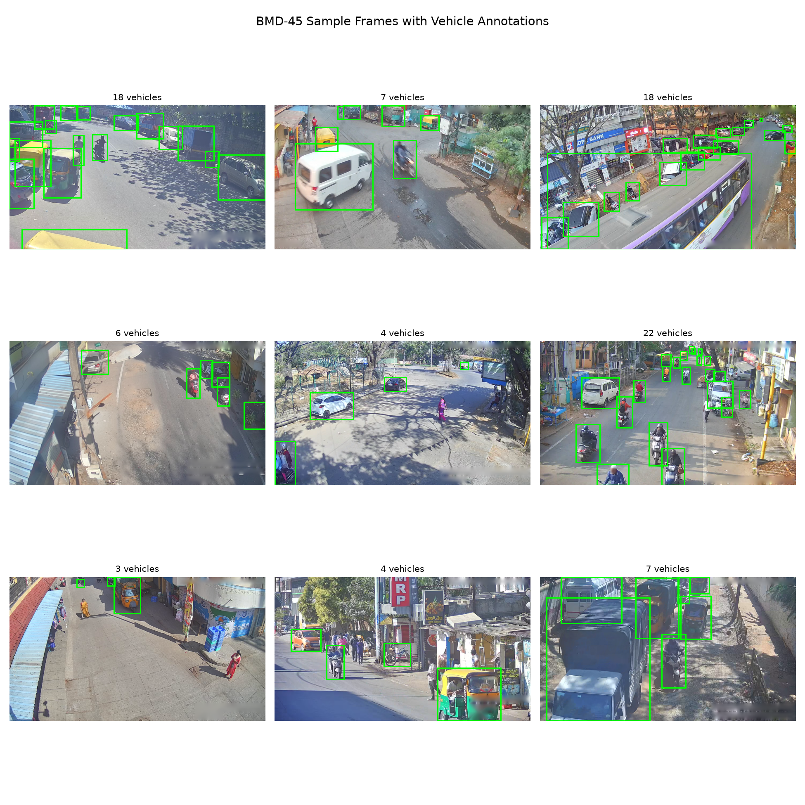
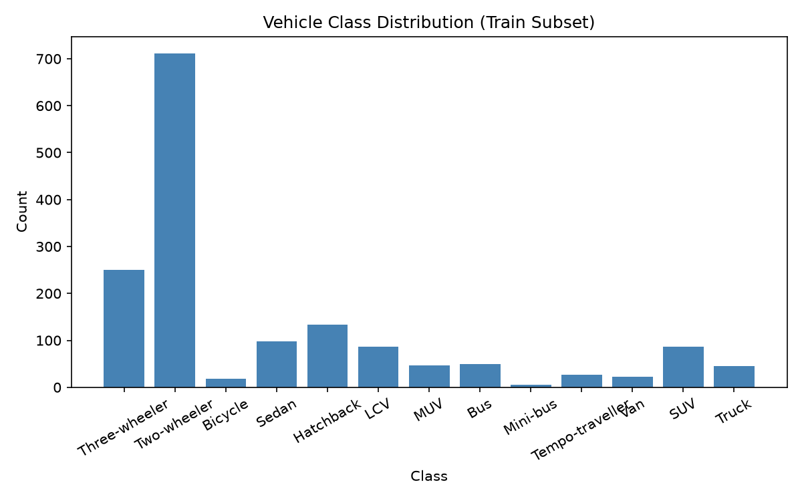
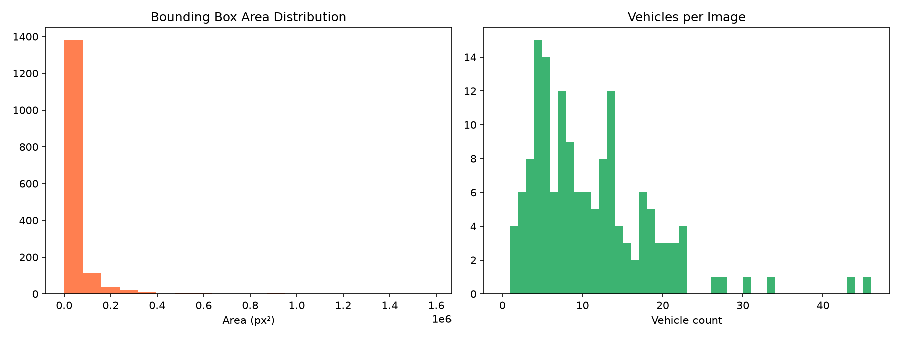
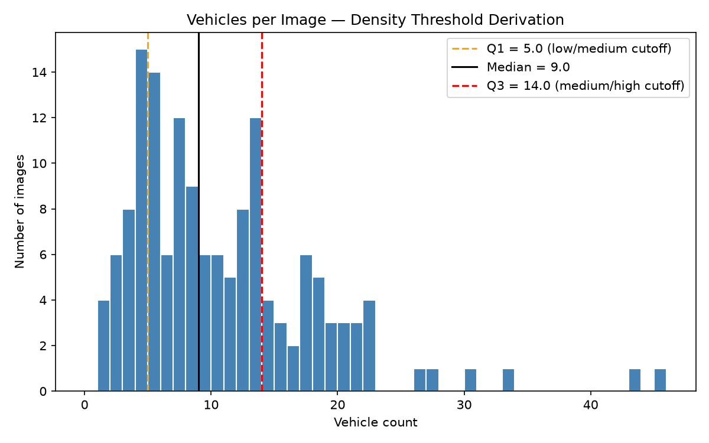

# Model Training

This document describes how the RF-DETR-Nano model was fine-tuned on a subset of
the BMD-45 (Bengaluru Mobility Dataset) for vehicle detection and traffic-state
labelling. It covers the environment, dataset preparation, data inspection,
annotation preprocessing, density-threshold derivation, model configuration,
the training run, outputs, and how to reproduce everything.

Image placeholders are included throughout. Replace the paths with real images
committed to the repository (for example under `docs/images/`) so they render on
GitHub. Some paths point to plots that `training_mps.py` already writes to
`outputs/`.


## 1. Environment

- Hardware: Apple Silicon (MPS backend). The code also runs on CUDA or CPU.
- Package manager: uv.
- Backend selection: automatic, in the order MPS, then CUDA, then CPU.

Install the training dependencies. PyTorch is platform and hardware dependent
(CPU, CUDA version, or Apple MPS), so install it first using the official
selector at https://pytorch.org/get-started/locally/, then install the project
and the training extras:

```
uv venv

# Install the torch/torchvision build that matches your hardware first
# (see the selector for the exact command).
uv pip install torch torchvision

# Then the project and training extras
uv pip install -e .
uv pip install "rfdetr[train,loggers]"
```

Note on macOS: DataLoader workers are set to 0 during training to avoid the
spawn start-method crash that occurs when a flat script starts worker processes.


## 2. Dataset subset

- Source: iisc-aim/BMD-45 on the Hugging Face Hub (traffic-camera frames from
  Bengaluru), with COCO-format annotations.
- Subset size: 150 training images and 30 validation images.
- Shard: only the first image shard (images_000) is used.
- Classes (13): Hatchback, Sedan, SUV, MUV, Bus, Truck, Three-wheeler,
  Two-wheeler, LCV, Mini-bus, Tempo-traveller, Bicycle, Van.

Placeholder: overview of the dataset source or a contact sheet of raw frames.

<!-- TODO: add image -->


## 3. Frame selection and extraction

The prepared subset is published on the Hugging Face Hub, so clone it directly
(uses Git-Xet for large files, see https://hf.co/docs/hub/git-xet):

```
brew install git-xet
git xet install
git clone https://huggingface.co/datasets/M20VJ/bmd45_subset
```

The clone already contains the images, COCO annotation files, and the
train/valid/test structure. No extra download or build step is needed.

The subset was originally built deterministically from the BMD-45 COCO split
files:

1. Read the COCO split JSON files for train and validation.
2. Keep only images whose file name belongs to the images_000 shard.
3. Sort those images by numeric file name for reproducibility.
4. Take the first N per split (150 train, 30 validation).
5. Keep the raw images for those selections with matching COCO annotation files.
6. Copy the validation split to a test split (RF-DETR expects train/valid/test).

Resulting layout:

```
bmd45_subset/
    train/   images + _annotations.coco.json
    valid/   images + _annotations.coco.json
    test/    images + _annotations.coco.json
```

Placeholder: split summary chart (written to `outputs/split_summary.png`).




## 4. Data inspection

Before training, the training subset is inspected visually and statistically.
`training_mps.py` writes these plots to `outputs/`.

Sample frames with ground-truth bounding boxes:



Vehicle class distribution in the training subset:



Bounding-box area distribution and vehicles-per-image distribution:



Placeholder: a single annotated example at full resolution.

<!-- TODO: add image -->


## 5. Annotation preprocessing

Object-detection datasets often contain runaway boxes that extend past the image
edge, and degenerate or zero-area boxes. These can raise errors during training.
Before training, annotations are sanitised:

- Every box is clipped to the image bounds, from (0, 0) to (width, height).
- Boxes whose clipped width or height is below a minimum, or whose area is below
  a minimum, are dropped.
- The COCO area field is recomputed to match the clipped box.

This mirrors the clip and minimum-area handling described in the RT-DETRv2
reference. RF-DETR performs resize, normalisation, and augmentation internally,
so no manual augmentation pipeline is added here.

Placeholder: before/after visualisation of a clipped box.

<!-- TODO: add image -->


## 6. Density cutoffs and display cap

The roadway-density label is calibrated to the vehicles-per-image distribution
of the training subset (all vehicle classes).

Current subset statistics:

```
images:  150
min:     1
max:     45
mean:    10.5
median:  9
Q1:      5
Q3:      14
p99:     ~38
```

Label rule, using integer cutoffs:

```
count == 0          -> unclear
1 <= count <= 5     -> low
6 <= count <= 11    -> medium
count >= 12         -> high
```

The low/medium boundary at 5 is Q1. The medium/high boundary at 11 is the
natural trough in the distribution, chosen over Q3 = 14 because Q3 would
over-inflate the medium class. The descriptive stats are cached to
`outputs/density_thresholds.json`.

Display cap: individual frames can contain a large outlier count (the tail
reaches 45+). The displayed count is capped (default 22) so outliers do not
distort the UI or aggregate stats. The density label is always computed from the
true, uncapped count.

Placeholder: threshold-derivation histogram (written to
`outputs/density_threshold.png`).




## 7. Model configuration

- Architecture: RF-DETR-Nano (DINOv2 backbone with a DETR-style detection
  transformer).
- Initialisation: Roboflow pretrained weights.
- Detection head: re-initialised to the 13 BMD-45 classes, detected
  automatically from the dataset annotations.

Placeholder: architecture diagram.

<!-- TODO: add image -->


## 8. Training run

Hyperparameters:

```
epochs:               40
batch size:           4
gradient accumulation: 4      (effective batch 16)
learning rate:        5e-5
seed:                 42
dataloader workers:   0        (macOS spawn-safe)
device:               mps      (auto-selected)
```

Run training:

```
uv run python training_mps.py
```

Placeholder: training loss curve and validation mAP curve. These can be built
from `rfdetr-nano-bmd45-finetune/metrics.csv`.

<!-- TODO: add image -->


<!-- TODO: add image -->


## 9. Outputs and checkpoints

Training writes to `rfdetr-nano-bmd45-finetune/`:

```
checkpoint_best_ema.pth       # EMA-averaged best weights (default for inference)
checkpoint_best_regular.pth   # best raw-epoch weights
last.ckpt                     # last Lightning checkpoint
metrics.csv                   # per-epoch metrics
hparams.yaml                  # hyperparameters
events.out.tfevents.*         # TensorBoard logs
```

Inference uses `checkpoint_best_ema.pth` by default. Override it with the
`TRAFFIC_STATE_CHECKPOINT` environment variable, or select a checkpoint in the
Streamlit app sidebar.

If you do not want to train, clone the fine-tuned weights from the Hugging Face
Hub instead (uses Git-Xet for large files, see https://hf.co/docs/hub/git-xet):

```
brew install git-xet
git xet install
git clone https://huggingface.co/M20VJ/rfdetr-nano-bmd45-finetune
```


## 10. Evaluation

RF-DETR logs COCO-style mAP and mAR on the validation split each epoch (see
`metrics.csv` and the TensorBoard logs). At the task level, predicted density
labels can be compared against ground-truth density labels on the validation
images.

Placeholder: results table and qualitative detection examples.

<!-- TODO: add results table image or a Markdown table of final metrics -->


<!-- TODO: add image -->


Example metrics table to fill in:

```
Metric            Value
mAP@0.50          TODO
mAP@0.50:0.95     TODO
mAR               TODO
Density accuracy  TODO
```


## 11. Reproduce

```
# 1. Install dependencies (install the torch build for your hardware first;
#    see https://pytorch.org/get-started/locally/)
uv venv
uv pip install torch torchvision
uv pip install -e .
uv pip install "rfdetr[train,loggers]"

# 2. Clone the prepared dataset subset (Git-Xet)
brew install git-xet
git xet install
git clone https://huggingface.co/datasets/M20VJ/bmd45_subset

# 3a. Train ...
uv run python training_mps.py

# 3b. ... or clone the fine-tuned weights (Git-Xet)
git clone https://huggingface.co/M20VJ/rfdetr-nano-bmd45-finetune

# 4. Run inference (see README.md for full options)
uv run traffic-state --input bmd45_subset/valid --method otsu --format csv
```


## 12. Notes and limitations

- The model is trained on a small subset for a short, time-boxed run. This is a
  pipeline demonstration, not an accuracy-optimised model.
- Density labels are count-based, so occlusion, night frames, and small or
  distant vehicles can shift the label.
- The density cutoffs (5 and 11) are calibrated to this subset and are camera
  and scene dependent.
- No temporal information is used; results are per-frame only.


## Image placeholder checklist

Add these images (suggested location `docs/images/`) and confirm the paths above:

```
docs/images/dataset_overview.png
docs/images/annotation_example.png
docs/images/box_clipping.png
docs/images/architecture.png
docs/images/training_loss.png
docs/images/val_map.png
docs/images/eval_metrics.png
docs/images/detection_examples.png
```

These plots are generated automatically by training_mps.py:

```
outputs/split_summary.png
outputs/sample_frames.png
outputs/class_distribution.png
outputs/box_and_density_dist.png
outputs/density_threshold.png
```
